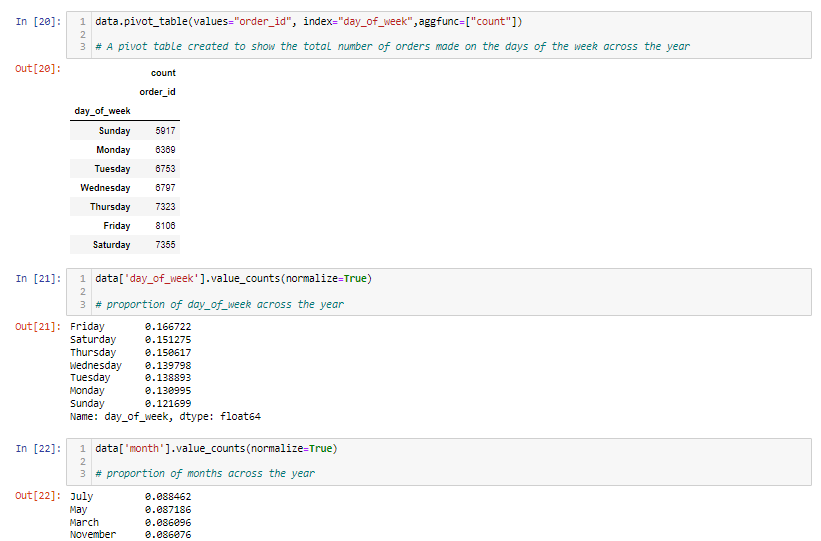

# Pizzalytics

## Introduction
This case study is the Capstone Project of Google Data Analytics Professional Certificate .In this Case Study I'm working as a Junior data analyst working for a Fictional Business Intelligence consultant and I have been at this job for six months, and my boss feels you are ready for more responsibility.I have been asked to lead a project for a brand new client Guissepe Carlos who is The Proprietor of a Carlos Pizza a fictitious Pizza Parlor. I've been given the task of presenting data-driven recommendations/answers based on the question asked by the Proprietor of the Pizza Parlour for the improvement of sales for the business.
In order to answer the key business questions, I followed the steps of the data analysis process: ask, prepare, process, analyze, share, and act.

## Ask
This phase involves defining the problem and questions asked. It’s the process of asking the right questions, knowing what problems you’re solving by defining the stakeholders expectations.
For the purpose of this project we have been asked the following questions:
    - How many customers do we have each day? Are there peak hours?      
    - How many pizzas are typically in an order? Do we have any best sellers?
    - How much money did we make this year? Can we identify any seasonality in the change?
    - Are there any pizzas we should take off the menu? Or Promotion we could leverage?
     
**Key Stakeholders**:

     1. Aaron Aaron (my boss)
     2. Guissepe Carlos (Pizza Parlor Proprietor)
   
   NOTE: Names are Completely Fictional

## Prepare
The second stage involves the collation and collection of data relevant to the problem we’re trying to solve. In this phase you’ll need to understand the different metrics needed for analysis in order to get the accurate data suitable for your analysis.
 
- The Data being used for this analysis was obtained from the Maven analytics Data playground.
- There are 4 different tables available on the dataset Orders, Orders_details, Pizza, Pizza_types table will be used for analysis.
- It is structured and well organized Data.
- It is a Year worth sales from the fictitious Pizza Parlour
- The Data has been made available by Vicent-Arel Bundock(R-Datasets) , License:Public Domain
- The Data is accurate and Consistent
- The Data is Reliable, Original, Comprehensive, Current and Cited (as in ROCCC)

## Process
Before the data was processed I had to import it into Jupyter notebook to begin data analysis, below is a preview:

This step is designed to make the Data clean, transform it and make it ready for analysis as analyzing dirty Data gives false insights which when implemented or followed can lead to making the wrong decision. 
On this project the necessary steps taking to ensure that the Data was clean and ready for analysis includes:
- Checking for Missing Values: This was to ensure that the Data was complete and comprehensive as having missing values can affect our analysis negatively.
- Checking for Duplicated Records: Duplicated records reduces the confidence that you have in your data, making it difficult for proper analysis, the Data for this project actually contained no duplicates.
- Data Types Conversion: This was necessary as it provides significant support for transforming Data to match the specific requirements. It facilitated the removal of irrelevant data, allowing for more accurate analysis and insightful findings. During this project, the “Date_time'' column was converted to “date_time64” type so that the hour and day can be extracted from the column.
- Creation of New Columns: New columns were created from the transformation of old ones in order to aid the purpose of our analysis e.g the “Date_time'' column after being converted to “date_time64” type was transformed to give a new column “month”, while the “date” column after being converted to “date_time64” type was transformed to give 2 new columns: “day_of_week” and “hour”. The “date” and “time” column was also merged to give the “date_time” column.
- Columns Deletion: Columns irrelevant to our analysis were deleted in order not to clog our data but focus on the main columns, for this analysis the “date_time” and “time” column was deleted.
- Joins: The Data needed for this analysis was in 4 separate tables (orders, order_details, pizza_types,  pizza) and they were all joined to create a single table based on logical relationships between these tables.

You can find the remaining code for the Process step on my [Github Repsitory](https://github.com/JusttOdosa?tab=repositories)

## Analyze
In this next step, I used Python to gain better insights and understanding of the data in order to answer the question asked. Processes used includes Creation of pivot table, statistical analysis e.t.c. Below is a snippet of the code:

You can find the remaining code for the analyze step on my [Github Repsitory](https://github.com/JusttOdosa?tab=repositories)

## Share
This is the penultimate step of the Data Analysis Phase which involves communicating findings, summarizing results using data visualization and presenting findings to stakeholders  using a slideshow. With a Dataset already cleaned and analyzed a report was created on Microsoft Power-BI with the necessary visualizations and filters that answers the question asked at the beginning of the project. 
Below is an image of the report:

The report contains filters, so you can interact with the report [Here](https://app.powerbi.com/view?r=eyJrIjoiNzFmNzFiODgtNjQ0MS00NWNiLTk3MWYtM2ZjYzg3ZWIzZTVlIiwidCI6IjIwNzgxMzdiLTc0MTAtNDVjNy05NGI5LWU3YjU4YTEwOWMwYSJ9)

## Act
This is the final stage of the Data Analysis process where we use everything learned from our analysis and act upon it. Recommendations will be provided to the stake holder on how to solve the business problem and help them make a good decision.

**Conclusions**

- Peak hours are between 12pm and 1pm and between 5pm and 6pm
- There are generally more orders on Friday's and Saturday's (weekends)
- July being the peak month and Friday being the peak day of week
- There is typically one pizza in order
- The Classic category is the most ordered category
- The Large pizza is the most sought after pizza size
- Due to the large variety of pizza names there is not much difference between them, but The Classic Deluxe Pizza is the most ordered pizza.
- A total of 801,944 (in dollar) was made this year
- Total amount made per month was between 62,000 and 71,000 (in dollar) with July being the highest earning month
- Peak hours are Lunch and Dinner time.

**Recommendations**
- Discounts should be given to customers who orders more than 1 quantity of pizza
- Special packages be created to be sold on hours other than peak hours
- New activities/Setups like karaoke, Mini Bar, snooker, can be added to the Pizza Parlor once it's night time to increase customers traffic at hours past 6:00 pm.
- A Customer Reward Program can be implemented and judged based on metrics approved by the Pizza Parlor e.g Customer Reward for any Customer who orders more than 100 pizzas in one Calendar year.
